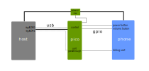

# pmostest pico

This is the firmware for the Raspberry Pi Pico that is providing the
interface between the control computer and the phone under test.

The task of the Pico device is to automate pressing the buttons on the device
and act like an USB to UART adapter for the serial debug port. The Pico
also has the ability to switch off the power to the phone by interrupting
the power lines in the USB connection.

The Pico firmware uses tinyusb to create two USB ACM devices that will show up
as two USB serial devices on the host machine. The first port is used to
send commands to the firmware to control buttons and power. The second port
is passed through to hardware UART lines hooked up to test points in the phone.